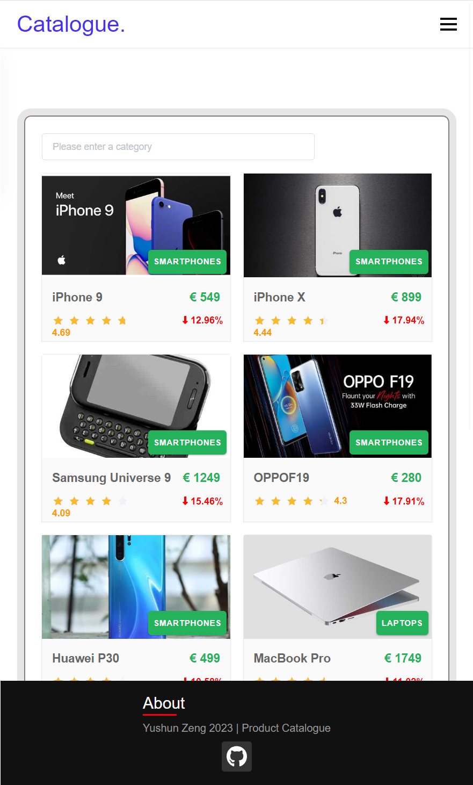
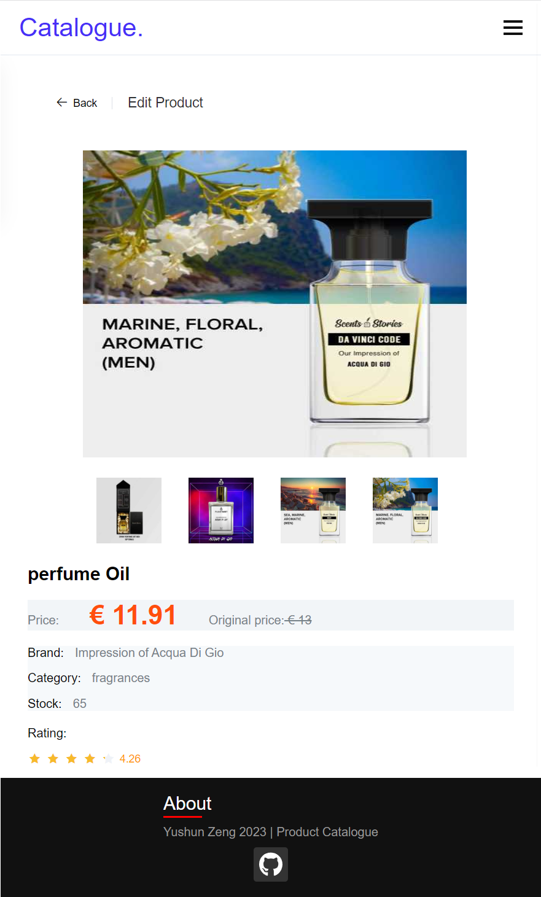
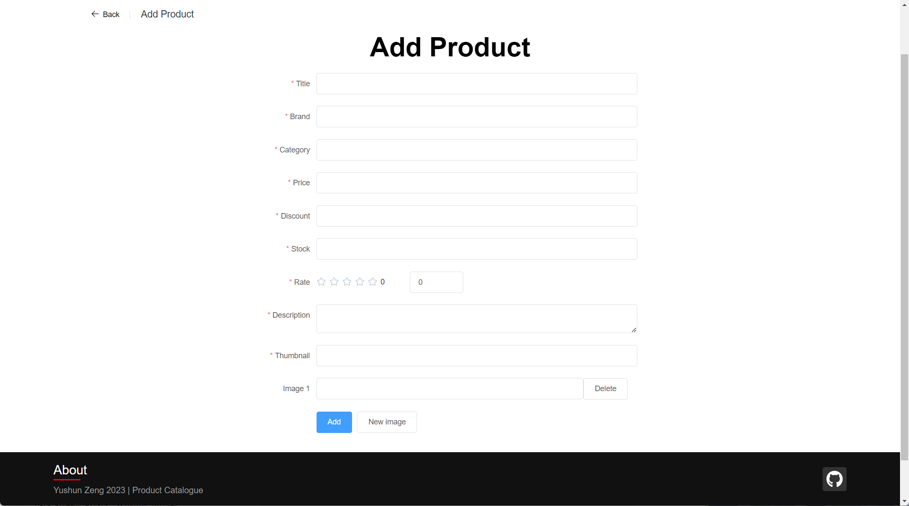

# Product Catalogue

## Website Introduction
- [How to Open this Website](#how-to-open-this-website)
- [Project Overview](#project-overview)

## How to Open This Website:
This is a front-end and back-end separation project. It initially requires two ports, but in order to facilitate the execution process, there are two ways provided:

```(Note*: The back-end server will automatically initiate the MongoDB when it starts, the database name is 'catalogue', the collection name is 'products' )```

1. (Need only one port: 8080) I packaged the front-end code and put in the back-end 'dist' folder. 

    To run it, open the project folder 'catalogue-server ' in the Visual Studio Code integrated terminal or system terminal. 
    
    In the terminal, execute "node server.js" and visit http://localhost:8080 
    
    (The npm packages are provided in the code under the "node_modules" folder. If you want to install it again with the "npm install", you can delete that folder and execute the command "npm install")

2. (Need two ports: 8000 8080) 

    Run the server first, open the project folder 'catalogue-server ' in the Visual Studio Code integrated terminal or system terminal, and execute "node server.js", server will run on the http://localhost:8080
    
    Run the client, open the project folder 'catalogue-client' in the Visual Studio Code or system terminal, and execute "npm run serve", then visit http://localhost:8000


## Project Overview:
1. Home page
<div align=center></div>
<p align=center>Home page</p><br>

<div align=center></div>
<p align=center>Product filter search function</p><br>

<div align=center></div>
<p align=center>Home page responsive</p><br>

2. Product detail page
<div align=center></div>
<p align=center>Product detail page</p><br>

<div align=center></div>
<p align=center>Product detail page responsive</p><br>

3. Add product page
<div align=center></div>
<p align=center>Add product page</p><br>

4. Product edit page
<div align=center></div>
<p align=center>Product edit page</p><br>
